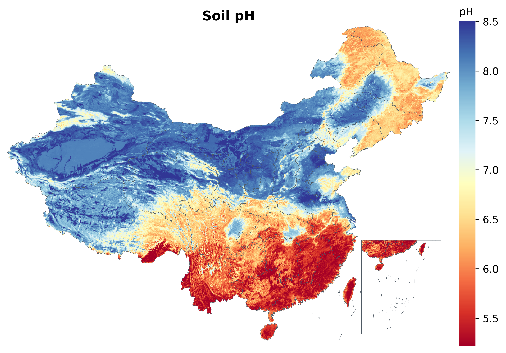
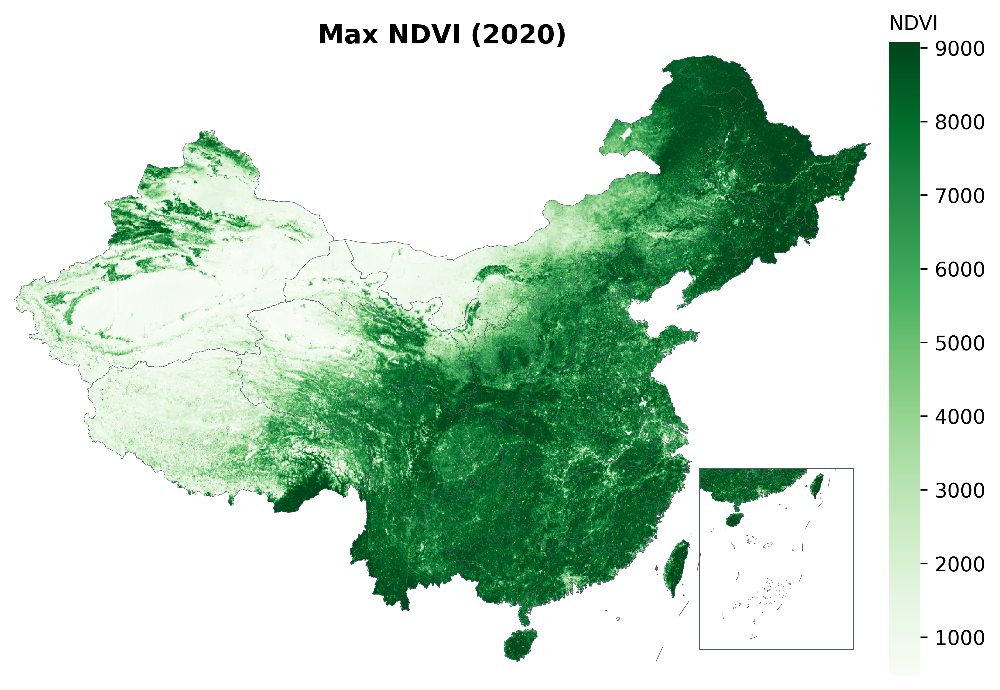

<div align="center">

# Very

**个人 Skill 仓库 · Personal Skills Collection**

_可复用、可组合、开箱即用的 Agent 技能集合_

<br/>

[](#-技能目录)
[](#)
[](#)
[](#-许可)
[](#-路线图)

</div>

---

## 📌 关于本仓库

**Very** 是我的个人 **Skill（技能）仓库**，用来沉淀那些经过打磨、可以反复调用的工作流与工具。

每个技能都遵循统一约定：一个自包含的目录，带 `SKILL.md` 说明、可执行脚本、内置资源与测试，
**克隆即用、无需额外配置**。目前以科研数据可视化为主，未来会逐步纳入更多方向的技能与工具。

> 定位：个人技能资产库 —— 让好用的东西可复用、可分享、可持续演进。

---

## 🧩 技能目录

| 技能 | 说明 | 引擎 | 状态 |
|------|------|------|------|
| [**geo-viz**](skills/geo-viz) | 把栅格数据（GeoTIFF）渲染成出版级中国地图，自动带南海九段线 + 小地图、Nature 级配色、600dpi 透明 PNG + 矢量 PDF | Python / R | ✅ 稳定 |

<sub>更多技能开发中，见 [路线图](#-路线图)。</sub>

---

## ⭐ 精选：geo-viz

> 一行命令，把地理栅格数据画成规范、好看、能直接进论文的中国地图。

<div align="center">

&nbsp;&nbsp;

<br/>
<sub>使用本技能对真实环境栅格渲染的实测结果　·　左：土壤 pH（发散配色）　·　右：最大 NDVI（顺序配色），均含右下角南海小地图</sub>
</div>

<br/>

**核心能力**

- 🌏 **自动化流程** —— 重投影至 EPSG:4326、按中国边界掩膜、2–98 分位截断防离群值
- 🧩 **合规底图** —— 中国省界 + 南海九段线，右下角自动生成南海诸岛小地图
- 🎨 **Nature 级配色** —— 20+ 语义化色盲友好色带，按变量类型（温度/降水/植被/高程/人口…）选色
- 📊 **连续 + 离散** —— 连续场自动渐变，分类数据自动图例（CLCD 9 类等）
- 🖨️ **出版级输出** —— 600dpi 透明 PNG + 矢量 PDF，论文 / PPT 直接用
- 🔁 **双引擎** —— Python（`rasterio/geopandas/matplotlib`）与 R（`terra/sf/ggplot2`），CLI 参数完全一致

**快速上手**

```bash
# Python
python skills/geo-viz/scripts/render_china_map.py \
    --input data.tif --output out/temp \
    --title "Annual Mean Temperature" --legend "degC" --palette temp --clamp

# R（参数一致）
Rscript skills/geo-viz/scripts/render_china_map.R \
    --input data.tif --output out/temp \
    --title "Annual Mean Temperature" --legend "degC" --palette temp --clamp
```

完整用法见 [skills/geo-viz/SKILL.md](skills/geo-viz/SKILL.md)。

---

## 🗂 仓库结构

```
Very/
├── skills/                     所有技能
│   └── geo-viz/                中国栅格地图渲染
│       ├── SKILL.md            技能说明（能力 / CLI / 原理）
│       ├── scripts/            render_china_map.{py,R} + requirements.txt
│       ├── assets/china/       内置底图（省界 / 九段线，WGS-84）
│       ├── references/         配色键与地类定义
│       ├── examples/           实测示例图（真实数据渲染结果）
│       └── tests/              自包含冒烟测试
├── .gitignore
└── README.md
```

---

## 🚀 使用方式

1. **克隆仓库**
   ```bash
   git clone https://github.com/EldonQ/Very.git
   ```
2. **进入某个技能目录**，阅读它的 `SKILL.md` —— 里面有该技能的完整用法、依赖与示例。
3. **按需安装依赖**（如 geo-viz 的 Python 依赖）：
   ```bash
   pip install -r skills/geo-viz/scripts/requirements.txt
   ```
4. **运行脚本 / 跑测试** 验证环境：
   ```bash
   python skills/geo-viz/tests/test_render.py   # RESULT: PASS
   ```

---

## 🧭 技能约定

为保持一致性，本仓库每个技能尽量满足：

- **自包含** —— 内置必要资源（底图、示例），减少外部依赖
- **有 `SKILL.md`** —— 第三人称说明「做什么 / 何时用 / 怎么用」
- **可测试** —— 提供最小可运行的冒烟测试
- **跨语言友好** —— 条件允许时提供多引擎实现，参数保持一致

---

## 🛣 路线图

- [x] `geo-viz` — 中国栅格地图渲染（Python + R）
- [ ] 更多科研可视化技能（时序、多面板拼图、专题制图模板）
- [ ] 数据处理 / 自动化工作流类技能
- [ ] 技能索引与统一调用入口

> 仓库定位会随需要演进，未来不限于科研可视化。

---

## 📄 许可

除非各技能目录另有说明，本仓库代码以 **MIT** 许可开放。内置地图矢量等第三方资源，
版权归原始提供方，请在使用前确认其许可条款。

---

<div align="center">
<sub>由 <b>@EldonQ</b> 维护 · 持续演进中 ✨</sub>
</div>
